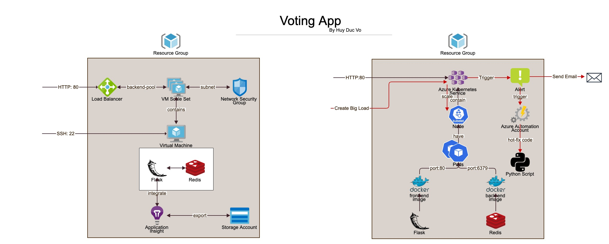
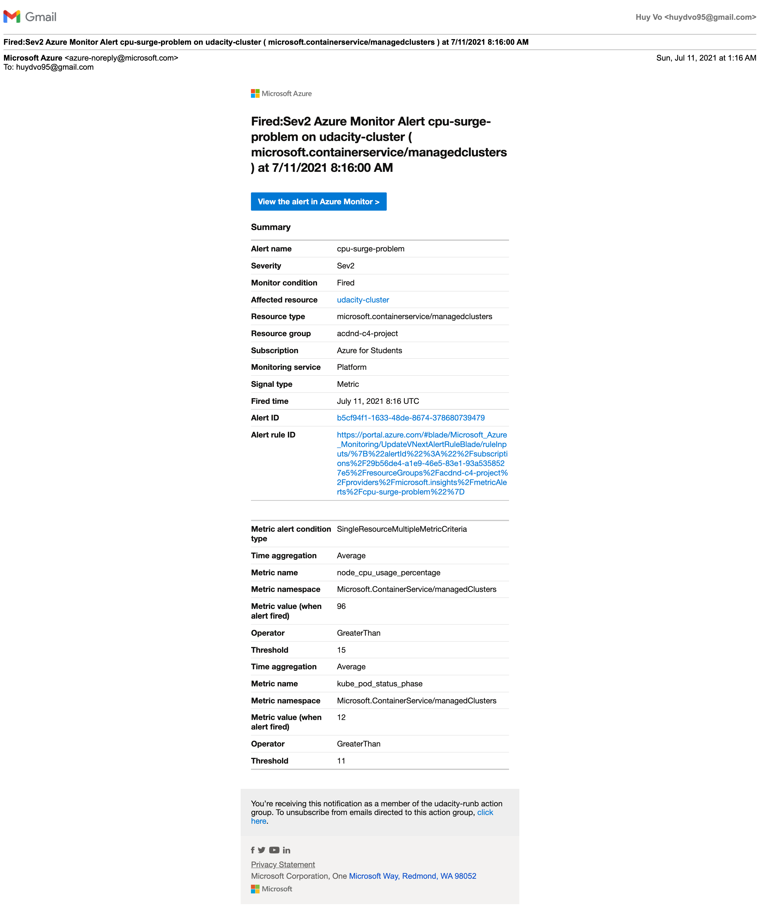

# Project  - *Voting App*

**Voting App** is a Python Flask-Redis powered web application allows user to vote for cat or dog or reset the vote count ... 

## User Stories

The following **required** user stories are complete:

- [x] Setup Application Insights on a VMSS and implement monitoring in an application to collect telemetry data
- [x] Setup an auto-scaling for a VMSS
- [x] Setup an Azure Automation account and create a RunBook to automate the resolution of performance issues
- [x] Create alerts to trigger auto-scaling on an AKS cluster and trigger a RunBook to execute

The following **technical** specification are implemented:

- [x] Azure Load Balancer
- [x] VM Scale Set
- [x] Network Security Group
- [x] Virtual Machine
- [x] Flask/ Redis
- [x] Application Insight
- [x] Storage Account
- [x] Azure Kubernetes Service
- [x] Docker
- [x] Alert
- [x] Azure Automation Account
- [x] Runbooks

## Architecture

## Screenshots

## Notes

All the URI/URL and keys in the app are safe for public as all the resources are deleted.

## License

Copyright [2021] [Huy Duc Vo]

Licensed under the Apache License, Version 2.0 (the "License");
you may not use this file except in compliance with the License.
You may obtain a copy of the License at

http://www.apache.org/licenses/LICENSE-2.0

Unless required by applicable law or agreed to in writing, software
distributed under the License is distributed on an "AS IS" BASIS,
WITHOUT WARRANTIES OR CONDITIONS OF ANY KIND, either express or implied.
See the License for the specific language governing permissions and
limitations under the License.
